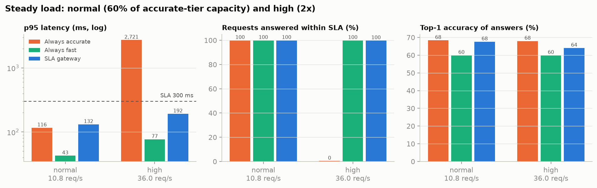
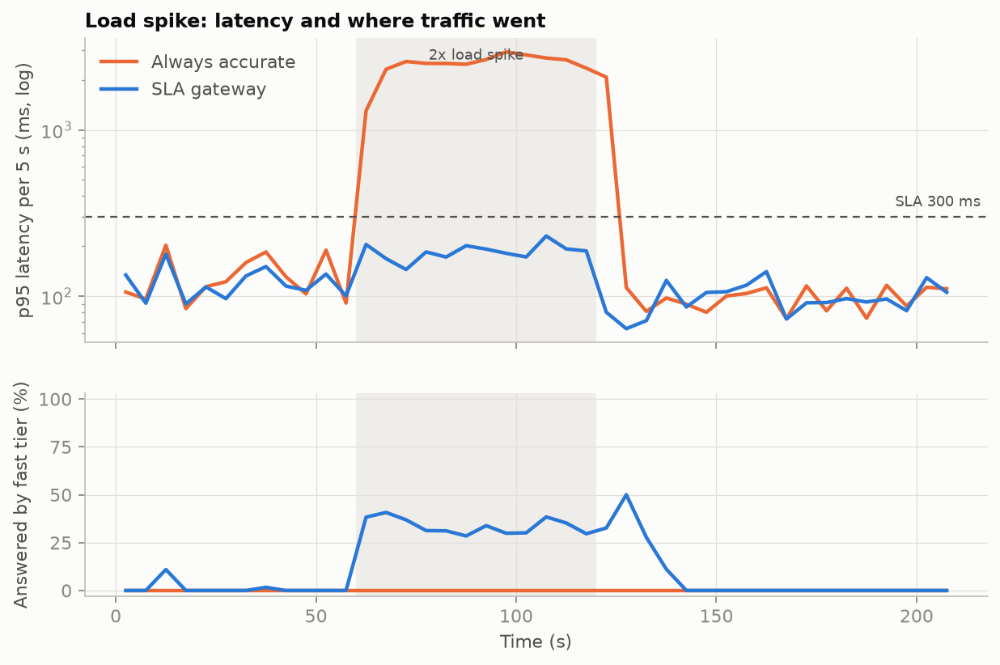
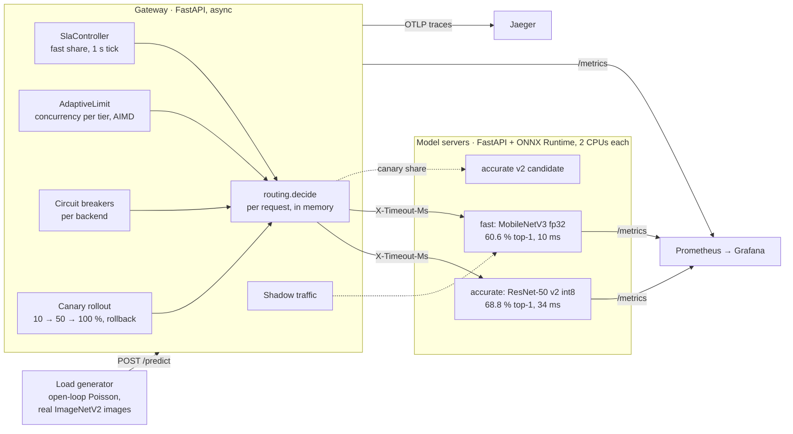
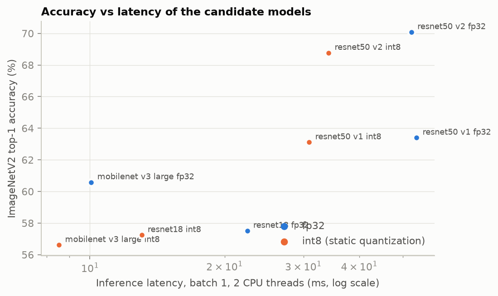
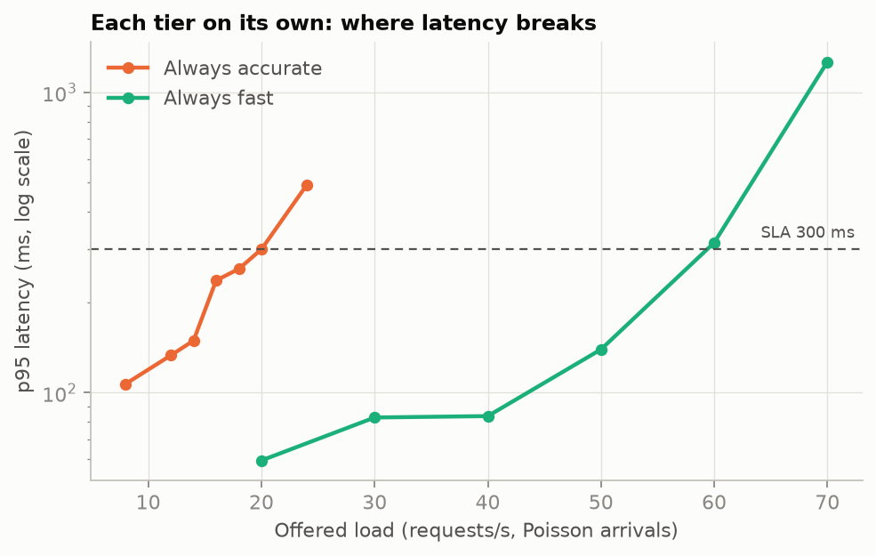
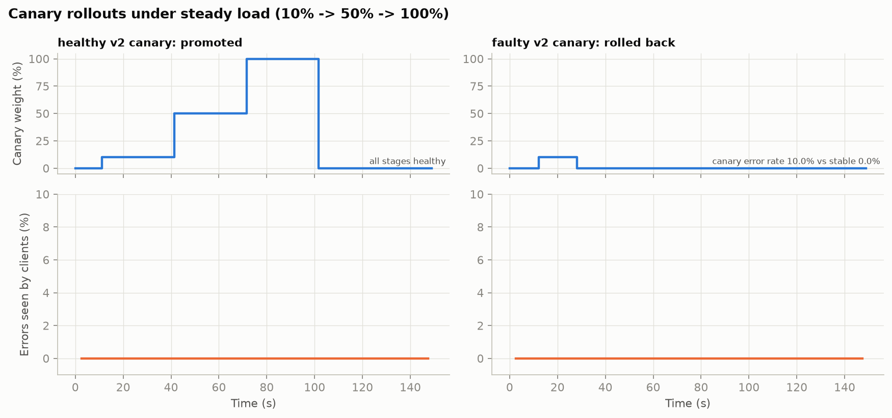

# SLA-Aware Inference Gateway

**Keeps image-classification latency inside an SLA by routing each request between an accurate
model and a fast one, based on live latency, and proves it under load: at 2× the accurate tier's
capacity, a plain proxy fails 27% of requests with a 2.7 s p95, while the gateway answers 99.8% within
the 300 ms SLA with zero errors and gives up 4 accuracy points instead of 8.**

By **Simran Kharbanda**


| Steady load, three policies | Traffic spike, latency and routing |
|---|---|
|  |  |

> Every number in this README was measured on this project's own code, on one laptop (Intel
> i7-9750H, 6 cores, 16 GB, Docker Desktop with 12 vCPUs), with each model server limited to 2 CPUs.
> Accuracy is on ImageNetV2, a held-out test set the pretrained models never saw. The load generator is
> open-loop, so queueing delay is not hidden. Details are in [Methodology](#methodology).

## Summary

| | |
|---|---|
| **Problem** | A single accurate model is fine at normal load and falls over in a spike: requests queue, p95 blows past the SLA, and eventually they time out. Always using a small fast model avoids that at a permanent accuracy cost. |
| **Approach** | Two model tiers behind one gateway. A feedback controller watches the accurate tier's rolling p95 and shifts traffic to the fast tier only under pressure, fast to protect and slow to give back. An adaptive concurrency limit spills bursts instantly; circuit breakers, deadline propagation, canary rollouts with automatic rollback, and shadow traffic round it out. |
| **Stack** | Python 3.12 · FastAPI · httpx · ONNX Runtime (static int8 quantization) · Prometheus + Grafana · OpenTelemetry + Jaeger · Docker Compose · Kubernetes (kind) with HPA · Core ML |
| **Key results** | At 2× capacity: **p95 2,721 → 192 ms, errors 27% → 0%, requests within SLA 0.4% → 99.8%** vs the naive proxy, with **64.1% top-1 vs 60.0%** for always-fast. A healthy canary was promoted 10→50→100% in 90 s; a faulty one was rolled back in 16 s with **zero client-visible errors**. |
| **Findings** | ONNX Runtime's spinning threads plus a container CPU limit caused CFS throttling: **p95 279 → 74 ms** by turning spinning off. int8 quantization gave ResNet-50 **1.5× lower latency for 0.3–1.3 pt**, and MobileNetV3 **−4 pt for almost nothing**. |
| **Quality** | 34 tests (all routing rules, controller hysteresis, breaker states, canary verdicts, end-to-end through fake backends), an open-loop load generator that also measures accuracy under load, every result repeated and its spread kept. |

## The problem

An image classifier is served on CPU. One model, ResNet-50, is accurate but takes about 50 ms per
image on two cores, so one replica handles about 18 requests/s before its p95 crosses 300 ms. Real
traffic is not flat. When a burst arrives, a plain proxy keeps queueing requests behind the model, the
queue grows faster than it drains, and within seconds every request is late, then most of them fail.

There is a second model, MobileNetV3, five times faster and about 8 points less accurate. The question
the gateway answers, per request and on live measurements, is: **is the accurate model about to break
its SLA? If not, use it. If so, use the fast one, and only for as long as needed.**

## Architecture



Nothing on the request path makes an extra network call: routing reads in-memory state that the
control loop updates once a second from the gateway's own measurements. Kubernetes runs the same
containers as Deployments with a CPU-based HorizontalPodAutoscaler on each tier.

## How it works

### 1. The gateway decides per request (`src/gateway/routing.py`)

For each request, in this order:

1. accurate tier's circuit breaker open → **fast**
2. accurate tier at its concurrency limit → **fast** (`accurate_saturated`, catches bursts shorter than a tick)
3. random draw below the controller's *fast share* → **fast** (`sla_pressure`)
4. otherwise → **accurate**

If the fast tier is also saturated the request goes to the accurate tier if it has room, and otherwise
gets an immediate 503 (`overloaded`). A fast failure is better than a request that blows the SLA and
delays every request behind it. Two baseline modes, `always_accurate` and `always_fast`, are plain
proxies with none of this; they are the comparison in every benchmark.

### 2. The controller shifts traffic quickly away, slowly back (`src/gateway/controller.py`)

Every second the `SlaController` looks at the accurate tier's p95 over the last 5 s window:

- **p95 above 80% of the SLA** (240 ms), or error rate above 5% → fast share **+0.25**, at most once per 2 s
- **p95 below 50% of the SLA** (150 ms), after a 5 s cooldown → fast share **−0.05** per tick
- in between → hold

The gap between the two thresholds and the asymmetry (+0.25 vs −0.05) stop the split from flapping.

The `AdaptiveLimit` does the same for concurrency, AIMD-style: latency above the high-water mark cuts
the tier's limit by 25%; when the limit was actually hit and latency is low, it grows by one. When the
autoscaler adds a replica, latency drops and the limit climbs to use it: the gateway never needs to
know the replica count.

### 3. Failure handling

- **Circuit breakers** (`breaker.py`): 5 consecutive failures open a backend for 5 s; one probe
  request closes it again.
- **Fallback**: if the accurate tier returns a 5xx or times out, the request is retried once on the
  fast tier within the remaining time budget.
- **Deadline propagation**: the gateway sends `X-Timeout-Ms` with every call. A request still queued in
  a model server when that budget has expired is dropped with a 504 instead of being computed for a
  client that has already gone away. Without this, a naive proxy at saturation leaves the server
  grinding through hundreds of orphaned requests while new ones wait behind them.
- **Backpressure**: each model server runs one inference at a time and queues at most 64 requests;
  the 65th gets an immediate 503, which the gateway sees as an early overload signal.

### 4. Canary rollouts (`src/gateway/canary.py`)

`POST /admin/canary {name, url}` starts a rollout of a new accurate-tier version at 10% of that tier's
traffic, then 50%, then 100%, 30 s per stage. At each stage, once both versions have at least 20
samples in a 60 s window, the canary must have an error rate no more than 2 points above the stable
version and a p95 no more than 1.25× stable + 20 ms. Pass every stage and it is promoted, becoming the
new stable. Fail once, or trip its circuit breaker, and it is rolled back to 0% immediately.

### 5. Shadow traffic

With `SHADOW_FRACTION=0.25`, a quarter of the requests answered by the accurate tier are also sent to
the fast tier in the background. The client only ever sees the accurate answer; the gateway records
whether the two top-1 predictions agree. It is a live estimate of what shifting traffic will cost in
accuracy, from real production inputs rather than a test set.

### 6. Model servers (`src/modelserver/`)

One ONNX model per container, `POST /predict` with raw image bytes, top-5 classes back. Pillow +
NumPy preprocessing (no PyTorch in the serving image; the accurate tier's model file is 26 MB),
Prometheus histograms for queue wait and inference time, liveness and readiness probes, and two fault
switches (`FAULT_ERROR_RATE`, `FAULT_LATENCY_MS`) used to build the faulty canary.

### 7. Observability

Prometheus scrapes the gateway and every model server every 2 s; a provisioned Grafana dashboard shows
request rate by tier, p95 against the SLA line, the controller's fast share, adaptive limits vs
in-flight requests, routing reasons, canary weight and breaker states. OpenTelemetry traces (sampled at
10%) follow a request from the gateway into the model server's queue-wait and inference spans in
Jaeger.

## Choosing the models

Eight candidates were exported to ONNX and evaluated on 9,500 held-out ImageNetV2 images (all 1,000
classes). int8 models use ONNX Runtime static quantization (QDQ, per-channel weights) calibrated on
500 *separate* images, so calibration never sees test data. Latency is single-image inference with 2
threads under a 2-CPU container limit, 1,000 runs, spinning disabled (see [Findings](#engineering-findings)).



| Model | Precision | Size | Top-1 | Top-5 | p50 / p95 |
|---|---|---|---|---|---|
| MobileNetV3-Large | fp32 | 22 MB | **60.58%** | 82.48% | **10.1 / 20.8 ms** |
| MobileNetV3-Large | int8 | 6 MB | 56.61% | 79.13% | 8.5 / 13.7 ms |
| ResNet-18 | fp32 | 47 MB | 57.51% | 80.13% | 22.5 / 35.5 ms |
| ResNet-18 | int8 | 12 MB | 57.24% | 79.89% | 13.1 / 16.5 ms |
| ResNet-50 v1 | fp32 | 102 MB | 63.40% | 84.78% | 53.7 / 79.7 ms |
| ResNet-50 v1 | int8 | 26 MB | 63.11% | 84.53% | 30.9 / 45.4 ms |
| ResNet-50 v2 | fp32 | 102 MB | 70.08% | 88.85% | 52.3 / 77.2 ms |
| **ResNet-50 v2** | **int8** | **26 MB** | **68.77%** | 88.37% | **34.2 / 60.8 ms** |

- **Accurate tier: ResNet-50 v2 int8.** Quantization cost 1.3 points (0.3 on the v1 weights) for
  1.5× lower latency and a quarter of the size. The newer v2 training recipe adds 6.7 points over v1
  for free.
- **Fast tier: MobileNetV3-Large fp32.** Its int8 version is only 1.6 ms faster and 4 points worse:
  depthwise convolutions and hard-swish activations quantize badly with MinMax calibration.
- ResNet-18 is dominated: slower than MobileNetV3 and less accurate.

The first plan, ResNet-50 fp32 as accurate and ResNet-50 int8 as fast, was dropped after this table:
with only 0.3 points between them you would serve int8 all the time and the router would have nothing
to do. Routing only earns its place when the tiers differ enough to matter.

### On-device: Core ML

`models/coreml_bench.py` converts the same models to Core ML (fp32, fp16, int8 weight-only) and runs
them on the Mac's CPU and GPU (AMD Radeon Pro 5300M, no Neural Engine). Top-1 on 2,000 ImageNetV2 images.

| Model | Precision | Size | Top-1 | CPU p50 | CPU+GPU p50 |
|---|---|---|---|---|---|
| ResNet-50 v2 | fp32 | 102 MB | 70.05% | 85.6 ms | **11.5 ms** |
| ResNet-50 v2 | int8 | 26 MB | 70.40% | 88.0 ms | 12.1 ms |
| MobileNetV3-Large | fp32 | 22 MB | 59.75% | 12.0 ms | 6.7 ms |
| MobileNetV3-Large | int8 | 6 MB | 60.15% | 14.1 ms | 6.1 ms |

The GPU makes ResNet-50 7× faster than CPU. Core ML's int8 is weight-only (dequantized before compute),
so it shrinks the model without speeding up the CPU path; ONNX Runtime's static quantization also
quantizes activations, which is why it does cut CPU latency above.

## Results

SLA: **p95 ≤ 300 ms end to end**, measured at the load generator. All runs use Poisson arrivals and
real test images; accuracy is the top-1 accuracy of whatever answered.

### 1. Where each tier breaks (capacity)

Each tier alone, 45 s per point, 3 repeats, median p95 (spread kept in `results/capacity.json`).



| Requests/s | 8 | 12 | 14 | 16 | 18 | 20 | 24 |
|---|---|---|---|---|---|---|---|
| Accurate tier p95 | 107 | 133 | 149 | 237 | 258 | 300 | 492 ms |

| Requests/s | 20 | 30 | 40 | 50 | 60 | 70 |
|---|---|---|---|---|---|---|
| Fast tier p95 | 60 | 83 | 84 | 139 | 316 | 1,263 ms |

The accurate tier holds the SLA to about **18 req/s**, the fast tier to about **50 req/s**. Both
curves show the classic queueing knee: flat, then vertical. The experiments below use 60% of the
accurate tier's capacity as *normal* load (10.8 req/s) and 2× as *high* load (36 req/s).

### 2. Steady load

120 s per run, first 20 s discarded, 1,114 requests at normal load and 3,681 at high load.

| Load | Policy | p50 | p95 | p99 | Within SLA | Errors | Fast share | Top-1 |
|---|---|---|---|---|---|---|---|---|
| Normal (10.8/s) | Always accurate | 52 | 116 | 149 ms | 100% | 0% | 0% | **68.4%** |
| | Always fast | 25 | 43 | 71 ms | 100% | 0% | 100% | 60.0% |
| | **SLA gateway** | 52 | 132 | 213 ms | 100% | 0% | 11% | 67.6% |
| High (36/s) | Always accurate | 2,351 | 2,721 | 2,898 ms | **0.4%** | **27.3%** | 0% | 68.0% |
| | Always fast | 30 | 77 | 145 ms | 99.97% | 0% | 100% | 60.0% |
| | **SLA gateway** | 51 | **192** | 244 ms | **99.8%** | **0%** | 45% | **64.1%** |

At normal load the gateway costs 0.8 points of accuracy: Poisson bursts occasionally exceed the
concurrency limit and spill to the fast tier. At 2× capacity the naive proxy collapses completely
(useful throughput 0.15 req/s), always-fast survives by being 8 points worse all the time, and the
gateway keeps 99.8% of answers inside the SLA while staying 4 points more accurate than always-fast.

### 3. Traffic spike

60 s normal → 60 s at 2× → 90 s normal, so the controller has to react *and* recover.

| Phase | Always accurate | SLA gateway |
|---|---|---|
| Before (10.8/s) | p95 145 ms · 100% in SLA · 68.0% | p95 125 ms · 100% · 67.9% |
| **Spike (36/s)** | **p95 2,752 ms · 1.3% in SLA · 25% errors** | **p95 188 ms · 99.8% in SLA · 0 errors · 34% fast · 64.5%** |
| After (10.8/s) | p95 130 ms · 97.2% (still draining the backlog) | p95 104 ms · 100% · 7% fast · 68.4% |

The lower panel of the spike figure shows the mechanism: the fast share rises within seconds of the
spike and decays over about 25 s after it ends, back to the accurate tier.

### 4. Canary rollouts

Under normal load, the stable accurate model (ResNet-50 v1 int8) is upgraded to v2 int8 twice: once
with a healthy v2 server, once with a v2 server that has an injected 8% error rate and +150 ms.



| Canary | Outcome | Timeline | Errors seen by clients |
|---|---|---|---|
| Healthy v2 | **Promoted** | 10% at 0 s → 50% at 30 s → 100% at 60 s → promoted at 90 s | 0.0% |
| Faulty v2 | **Rolled back** at 16 s: "canary error rate 10.0% vs stable 0.0%" | never left the 10% stage | 0.0% |

Clients saw no errors during the faulty rollout because the gateway's fallback retried each failed
canary request on the fast tier while the controller gathered evidence.

### 5. Shadow traffic

With 25% of accurate-tier requests mirrored to the fast tier: **62.4% top-1 agreement** (93 of 149).
The tiers score 68.8% and 60.6% on the test set, so they agree far less often than the 8-point gap
suggests. Each is right on different images, which is exactly what a shadow comparison on real traffic
reveals and a test-set number hides.

### 6. Kubernetes autoscaling

*Pending: the kind cluster run is in progress and this section is filled in from its results.*

## Engineering findings

**ONNX Runtime's thread pool spins, and CPU limits punish it.** By default ORT worker threads
busy-wait between operators. Under a Docker/Kubernetes CPU limit that spinning burns the container's
CFS quota; the kernel then throttles the whole container until the next 100 ms period, and requests
that arrive during the pause wait it out. The fast tier at 20 req/s: **p95 279 → 74 ms, p99 467 →
141 ms, CPU 162% → 52%** from one session option (`session.intra_op.allow_spinning = 0`), at a cost of
6 ms on the median. The cgroup counters confirmed it: 54% of CFS periods throttled before the change.

**A naive proxy's timeouts create orphaned work.** When the always-accurate baseline gave up on
requests after 30 s, the model server kept computing them, and after a saturating run it needed a
minute to drain answers nobody would read. Deadline propagation fixed it and is now on for every call.

**Benchmarks on a laptop need a settling step.** Early runs had a 6-second p95 at 40% load; the cause
was the machine swapping (19 GB of swap in use). Every run now waits until the gateway is idle and a
probe returns in under 150 ms before starting, and every point is repeated with its spread recorded.

**Quantize where it helps.** Static int8 gave ResNet-50 1.5–1.7× lower latency for 0.3–1.3 points,
and MobileNetV3 almost nothing for 4 points. The Core ML results show the other side: weight-only int8
shrinks the model but cannot speed up compute.

## Methodology

- **Open-loop load.** `loadtest/loadgen.py` schedules Poisson arrivals at the configured rate whether
  or not earlier requests have returned, and measures latency from each request's *scheduled* time.
  A closed-loop tool (Locust with a fixed number of users, also included for interactive use) sends
  less as the server slows down, which hides queueing delay. The difference matters most in exactly
  the overloaded cases this project is about.
- **Real inputs, real accuracy.** Every request is a held-out ImageNetV2 image with a known label, so
  each run reports the top-1 accuracy of the answers clients received, not a test-set proxy.
- **Fair resources.** Each model server gets the same 2-CPU limit; the gateway 1.5; the load generator
  runs inside the Compose network so host networking does not distort latency.
- **Repeats and settling.** Capacity points are run 3× with the median reported and the spread kept.
  Every run starts only after the previous one's queues have drained and a probe is fast.

## Limitations and future work

| Limitation | Next step |
|---|---|
| One gateway process; its in-memory state is not shared | Multiple gateway replicas with a shared view (or per-replica limits, which the AIMD design already tolerates) |
| The controller has fixed thresholds tuned to one SLA | Derive high/low water marks from the SLA and observed service time |
| Canary verdicts use error rate and p95 only | Add prediction agreement with the stable version (the shadow machinery already computes it) |
| CPU only | GPU tiers, batching in the model server (dynamic batching changes the queueing model) |
| One node (kind) | Multi-node cluster and a cluster-autoscaler experiment |

## Running it

```bash
make setup         # host venv for the gateway tests
make test          # 34 tests, no Docker needed
make data          # ImageNetV2 matched-frequency, 1.2 GB
make models        # export the 8 ONNX candidates (PyTorch runs only inside this builder image)
make evaluate      # accuracy on 9,500 images + latency under a 2-CPU limit
make up            # gateway :8080 · Prometheus :9090 · Grafana :3000 · Jaeger :16686
make canary        # also start the servers used by the canary experiment
make experiments   # capacity, steady, spike, canary, shadow (about 1.5 hours)
make charts        # results/*.json -> report/figures/*.png
make k8s-up        # kind cluster, metrics-server, both tiers, HPA, gateway
make k8s-hpa       # the autoscaling experiment
make coreml        # Core ML conversion + on-device benchmark (macOS)
```

Try it by hand once the stack is up:

```bash
curl -X POST --data-binary @some.jpg localhost:8080/predict      # routed_to, reason, top5, gateway_ms
curl localhost:8080/state                                          # controller, limits, breakers, canary
curl -X POST -H 'content-type: application/json' -d '{"mode":"always_accurate"}' localhost:8080/admin/mode
```

## Project layout

```
src/gateway/         routing.py (per-request decision) · controller.py (SLA controller, adaptive limit)
                     breaker.py · canary.py · stats.py (rolling windows) · config.py · app.py
src/modelserver/     ONNX Runtime FastAPI server, preprocess.py (Pillow + NumPy)
src/tracing/         OpenTelemetry setup shared by both services
models/              export.py (ONNX + int8) · evaluate.py · dataset.py · coreml_bench.py
loadtest/            loadgen.py (open-loop) · experiments.py · k8s_hpa.py · charts.py · locustfile.py
deploy/              registry.yaml (tiers + tuning) · prometheus/ · grafana/ · k8s/ (kind, HPA, jobs)
docker/              builder, modelserver, gateway, loadgen images
tests/               34 tests
results/             every number in this README, plus per-request CSVs under results/raw/
report/figures/      the charts
```

## Author

**Simran Kharbanda**
